---
## Front matter
lang: ru-RU
title: Презентация по лабораторной работе 1
subtitle: Установка и Конфигурация ОС на Виртуальную Машину"
author:
  - Ерфан Хосейнабади
institute:
  - Российский университет дружбы народов, Москва, Россия
date: 01 02 2026

## i18n babel
babel-lang: russian
babel-otherlangs: english

## Formatting pdf
toc: false
toc-title: Содержание
slide_level: 2
aspectratio: 169
section-titles: true
theme: metropolis
header-includes:
 - \metroset{progressbar=frametitle,sectionpage=progressbar,numbering=fraction}
---

# Выполнение лабораторной работы

Для начала я создаю новую виртуальную машину в VirtualBox. Потом мне нужно указать её имя и добавить оптический диск.

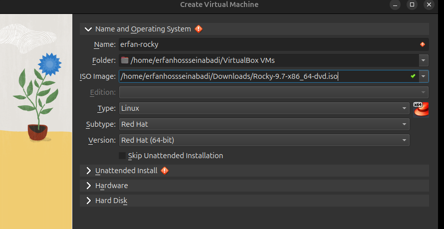{#fig:001 width=70%}

Указываю обьем памяти и создаю виртуальнный жетский диск.

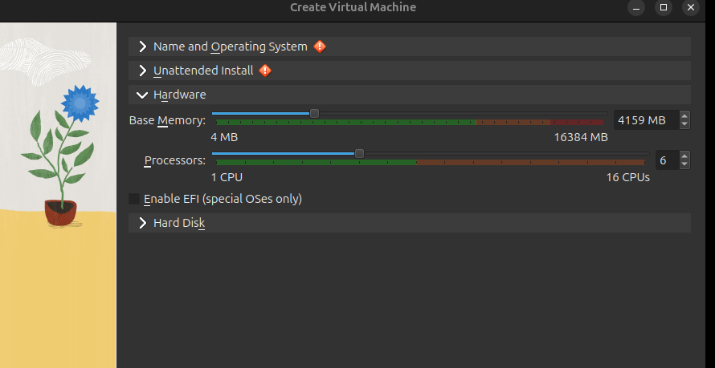{#fig:002 width=70%}

Жетский диск.

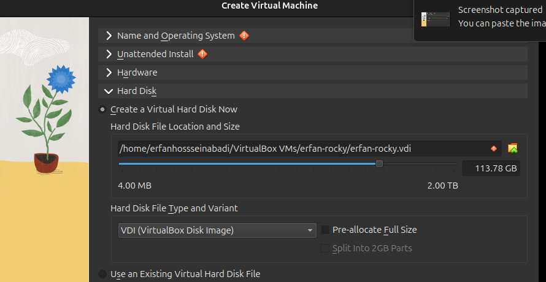{#fig:003 width=70%}

Проверяю подключения диска в носителях образ.

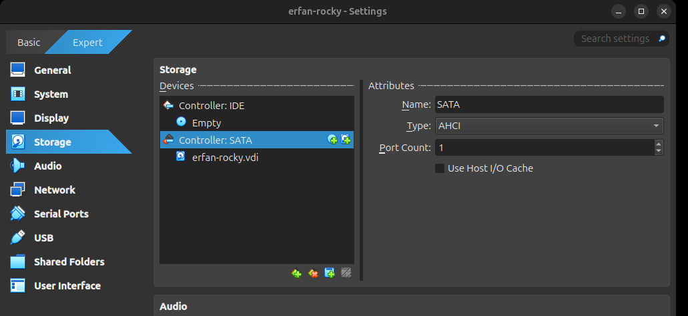{#fig:005 width=70%}

Выбираю язык установки.

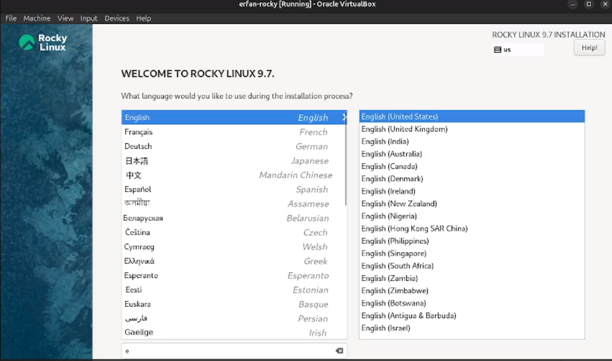{#fig:006 width=70%}

Выбираю место установки, отключаю kdump, создаю пользователя (администратор) и устанавливаю пароль для администратора. 

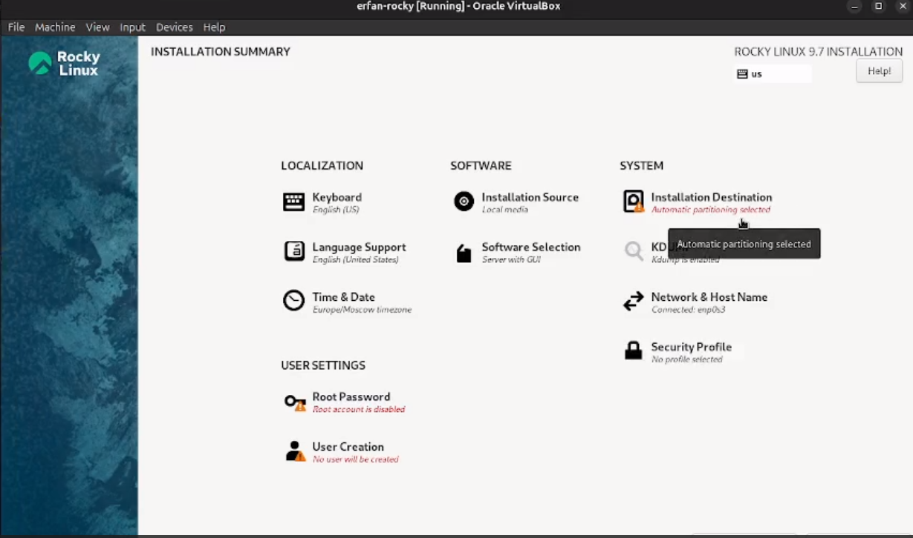{#fig:007 width=70%}

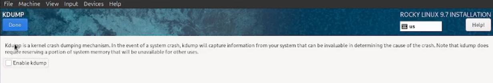{#fig:008 width=70%}

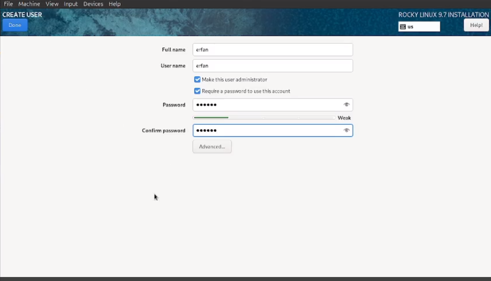{#fig:009 width=70%}

В качестве окружения я выбираю сервер с графическим интерфейсом (GUI) и дополнительно устанавливаю средства разработки.

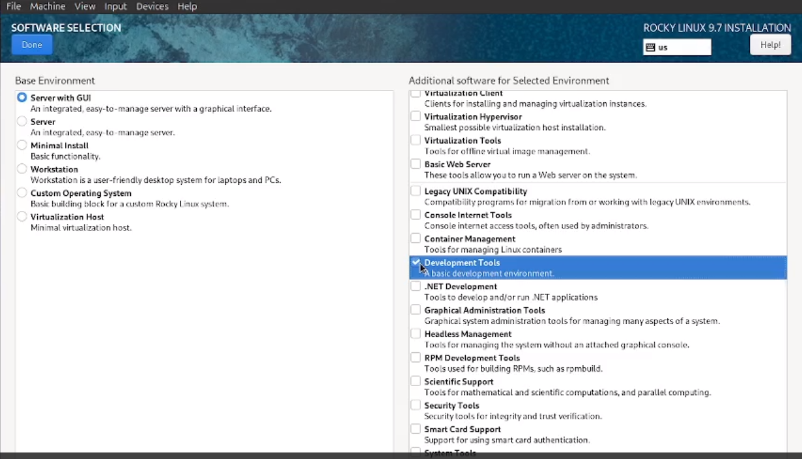{#fig:0010 width=70%}

Указываю имя узла.

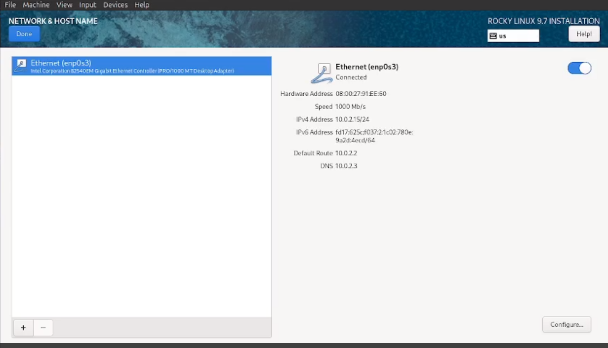{#fig:0011 width=70%}

Затем устанавливаю систему.
 
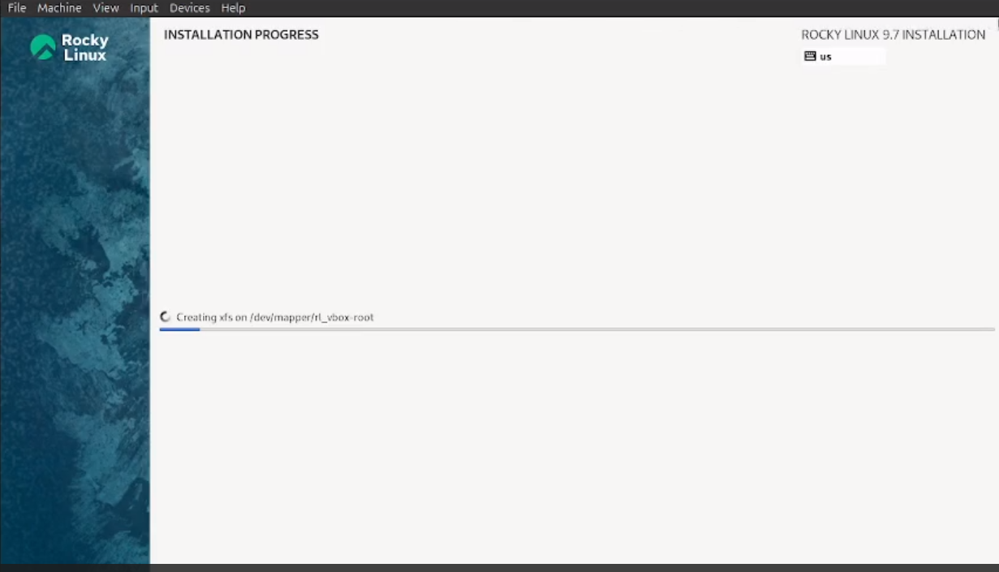{#fig:0012 width=70%}

# Выполнение дополнительной работы

Запускаю в терминале: dmesg 

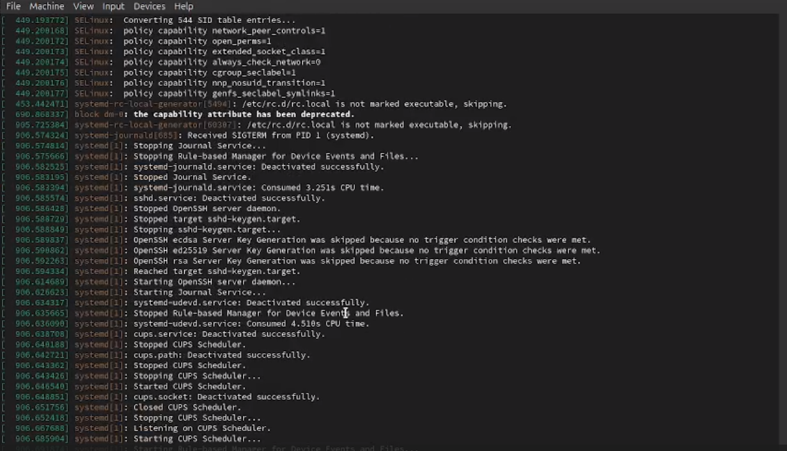{#fig:0013 width=70%}

dmesg | grep -i "detected", чтобы получить информацию о процессоре.

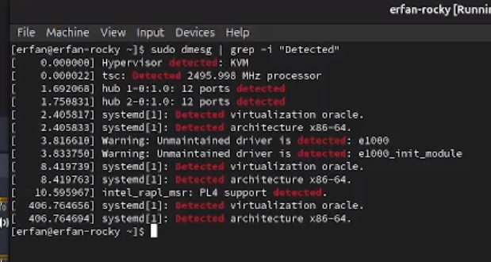{#fig:0014 width=70%}

dmesg | grep -i "CPU", чтобы получить информацию о модели процессора.

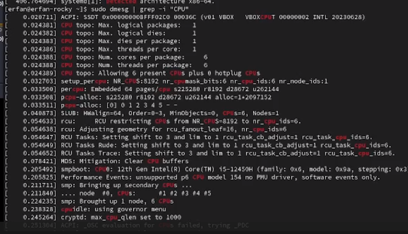{#fig:0015 width=70%}

dmesg | grep -i "memory", чтобы получить информацию о памяти.

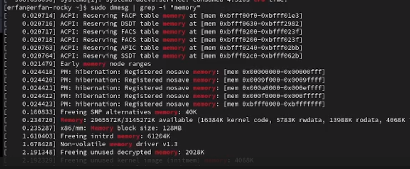{#fig:0016 width=70%}

dmesg | grep -i "detected", чтобы получить информацию о гипервизоре.

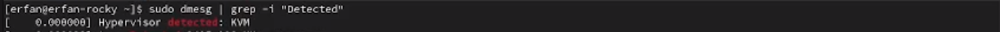{#fig:0017 width=70%}

sudo fdisk -l, чтобы получить информацию о файловой системе корневого раздела.

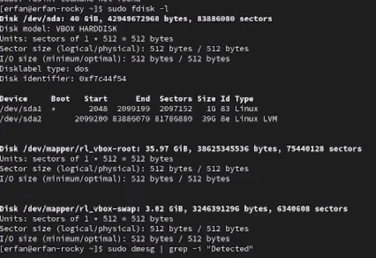{#fig:0018 width=70%}

dmesg | grep -i "mount", чтобы получить информацию о монтировании файловых систем.

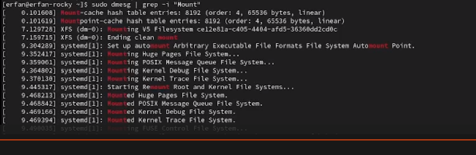{#fig:0019 width=70%}

# Ответы на контрольные вопросы

1. Учетная запись содержит необходимые для идентификации пользователя при подключении к системе данные, а так же информацию для авторизации и учета: системного имени (user name) (оно может содержать только латинские буквы и знак нижнее подчеркивание, еще оно должно быть уникальным), идентификатор пользователя (UID) (уникальный идентификатор пользователя в системе, целое положительное число), идентификатор группы (CID) (группа, к к-рой относится пользователь. Она, как минимум, одна, по умолчанию - одна), полное имя (full name) (Могут быть ФИО), домашний каталог (home directory) (каталог, в к-рый попадает пользователь после входа в систему и в к-ром хранятся его данные), начальная оболочка (login shell) (командная оболочка, к-рая запускается при входе в систему).

2. Для получения справки по команде: <команда> —help; для перемещения по файловой системе - cd; для просмотра содержимого каталога - ls; для определения объёма каталога - du <имя каталога>; для создания / удаления каталогов - mkdir/rmdir; для создания / удаления файлов - touch/rm; для задания определённых прав на файл / каталог - chmod; для просмотра истории команд - history

3. Файловая система - это порядок, определяющий способ организации и хранения и именования данных на различных носителях информации. Примеры: FAT32 представляет собой пространство, разделенное на три части: олна область для служебных структур, форма указателей в виде таблиц и зона для хранения самих файлов. ext3/ext4 - журналируемая файловая система, используемая в основном в ОС с ядром Linux.

4. С помощью команды df, введя ее в терминале. Это утилита, которая показывает список всех файловых систем по именам устройств, сообщает их размер и данные о памяти. Также посмотреть подмонтированные файловые системы можно с помощью утилиты mount.

5. Чтобы удалить зависший процесс, вначале мы должны узнать, какой у него id: используем команду ps. Далее в терминале вводим команду kill < id процесса >. Или можно использовать утилиту killall, что "убьет" все процессы, которые есть в данный момент, для этого не нужно знать id процесса. 

# Выводы
На практике я научилась устанавливать операционную систему на виртуальную машину и настраивать минимально необходимые сервисы для работы.

