# Цель работы

Получить практические навыки работы в консоли с атрибутами файлов дя групп пользоватей.

# Задание

1. Создать пользователя guest2 и добавить его в группу пользователей.
2. Заполнить таблицы.

# Выполнение лабораторной работы

Так как пользователь guest уже есть, я создаю guest2 и задаю ему пароль.

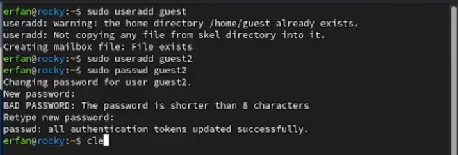{ width=70% }

Добавляю guest2 в группу guest:

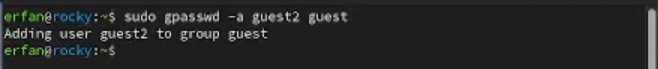{ width=70% }

Использую команду su, чтобы войти в систему от имени guest на одной консоли и от имени guest2 — на другой.

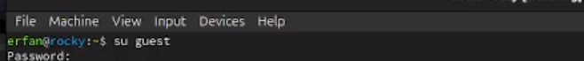{ width=70% }

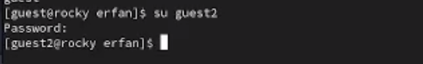{ width=70% }

С помощью команды pwd определяю своё текущее местоположение.

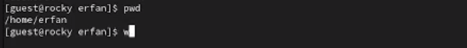{ width=70% }

Текущая директория, выведенная командой pwd, совпадает с приглашением командной строки.

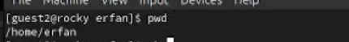{ width=70% }

С помощью whoami проверяю имя пользователя. id показывает группы и их gid.groups выводит список групп.
id -Gn — названия групп.
id -G — только коды групп.

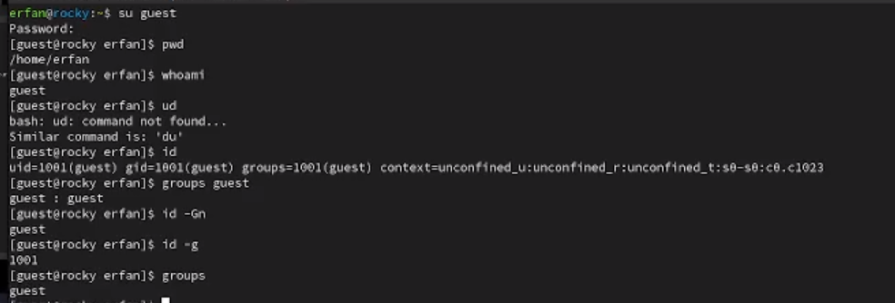{ width=70% }

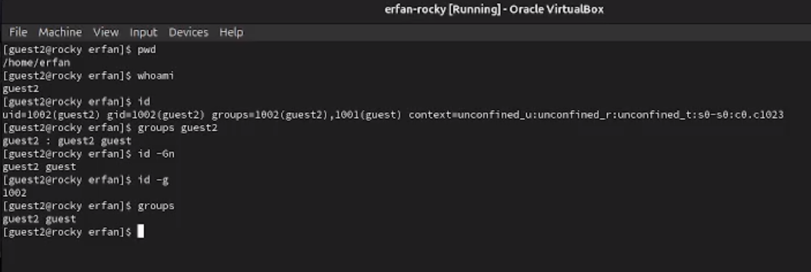{ width=70% }

Вывела интересующее меня содержимое файла etc/group, видно, что в группе guest два пользователя, а в группе guest2 один:

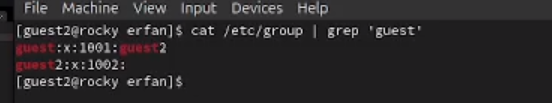{ width=70% }

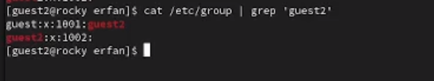{ width=70% }

Использую команду newgrp guest, чтобы зарегистрировать пользователя guest2 в группе guest.

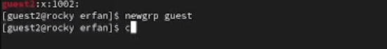{ width=70% }

Далее добавляю права на читение, запись и исполнение пользователей группы guest:

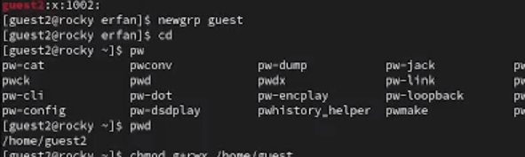{ width=70% }

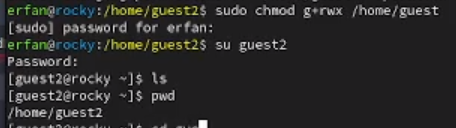{ width=70% }

Снимаю все атрибуты с dir1 (созданной в предыдущей работе) и проверяю, что права действительно сняты.

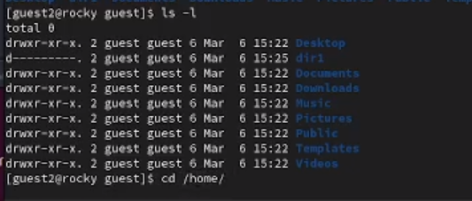{ width=70% }

Затем от имени guest2 проверяю доступ к файлам в dir1 и на основе результатов заполняю таблицы.

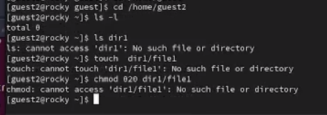{ width=70% }

## Заполнение таблицы

| Права директории | Права файла | Создание файла | Удаление файла | Запись в файл | Чтение файла | Смена директории | Просмотр файлов в директории | Переименование файла | Смена атрибутов файла |
|------------------|-------------|----------------|----------------|---------------|--------------|------------------|------------------------------|----------------------|-----------------------|
| d (000) | (000) | - | - | - | - | - | - | - | - |
| d--x (010) | (000) | - | - | - | - | + | - | - | + |
| d-w- (020) | (000) | - | - | - | - | - | - | - | - |
| d-wx (030) | (000) | + | + | - | - | + | - | + | + |
| d-r- (040) | (000) | - | - | - | - | - | - | - | - |
| d-rx (050) | (000) | - | - | - | - | + | + | - | + |
| d-rw (060) | (000) | - | - | - | - | - | - | - | - |
| d-rwx (070) | (000) | + | + | - | - | + | + | + | + |
| d--x (010) | r-- (040) | - | - | - | + | + | - | - | - |
| d--x (010) | -w- (020) | - | - | + | - | + | - | - | - |
| d--x (010) | -wx (030) | - | - | + | - | + | - | - | - |
| d--x (010) | r-x (050) | - | - | - | + | + | - | - | - |
| d--x (010) | rw- (060) | - | - | + | + | + | - | - | - |
| d--x (010) | rwx (070) | - | - | + | + | + | - | - | - |
| d-rx (050) | r-- (040) | - | - | - | + | + | + | - | - |
| d-rwx (070) | r-- (040) | - | - | - | + | + | + | - | - |
| d-rwx (070) | -w- (020) | - | - | + | - | + | + | - | - |
| - | - | - | - | - | - | - | - | - | - |

Table: Установленные права и разрешенные действия для групп

| Операция | Минимальные права на директорию | Минимальные права на файл |
|----------|---------------------------------|---------------------------|
| Создание файла | -wx (030) | не применяется |
| Удаление файла | -wx (030) | не применяется |
| Чтение файла | --x (010) | r-- (040) |
| Запись в файл | --x (010) | -w- (020) |
| Переименование файла | -wx (030) | не применяется |
| Создание поддиректории | -wx (030) | не применяется |
| Удаление поддиректории | -wx (030) | не применяется |

Table: Минимальные права для совершения операций от имени пользователей входящих в группу

# Выводы

В результате работы я получила навыки работы в консоли с атрибутами файлов.