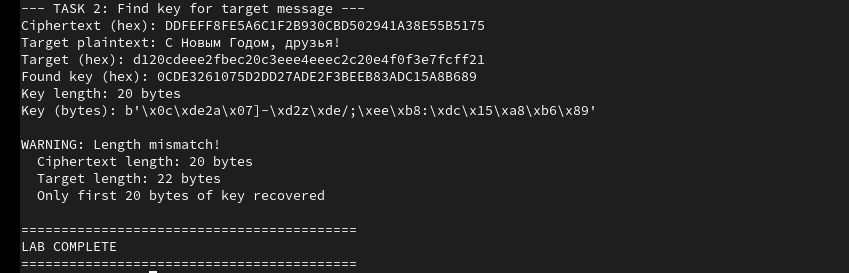

---
## Front matter
lang: ru-RU
title: Презентация по лабораторной работе 7
subtitle: Однократное гаммирование
author:
  - Ерфан Хосейнабади
institute:
  - Российский университет дружбы народов, Москва, Россия

## i18n babel
babel-lang: russian
babel-otherlangs: english

## Formatting pdf
toc: false
toc-title: Содержание
slide_level: 2
aspectratio: 169
section-titles: true
---

# Информация

# Цель работы

Освоить на практике применение режима однократного гаммирования — метода симметричного шифрования, основанного на операции XOR. Научиться решать две криптографические задачи: нахождение шифротекста по известному ключу и открытому тексту, а также восстановление ключа по известным шифротексту и открытому тексту.

# Выполнение лабораторной работы

## Схема однократного гаммирования Вернама

Гаммирование представляет собой наложение (снятие) на открытые (зашифрованные) данные последовательности элементов других данных, полученной с помощью некоторого криптографического алгоритма.

{#fig:001 width=70%}

## Операция XOR

Операция сложения по модулю 2 (XOR, обозначается ⊕) лежит в основе однократного гаммирования:

- 0 ⊕ 0 = 0
- 0 ⊕ 1 = 1
- 1 ⊕ 0 = 1
- 1 ⊕ 1 = 0

Метод является симметричным: двойное прибавление одной и той же величины восстанавливает исходное значение.

## Задание 1: Нахождение шифротекста

Известны:
- Открытый текст: `Штирлиц – Вы Герой!!`
- Ключ (hex): `050C177F0E4E37D29410092E2257FFC80BB27054`

Необходимо найти шифротекст по формуле:
\[C_i = P_i \oplus K_i\]

{#fig:002 width=70%}

## Результат первого задания

Открытый текст в кодировке CP1251 (hex): `d8f2e8f0ebe8f6209620c2fb20c3e5f0ee692121`

Вычисленный шифротекст (hex): `DDFEF8FE5A6C1F20230CBD502941A38E55B5175`

{#fig:003 width=70%}

Полученный шифротекст совпал с ожидаемым результатом из лабораторной работы.

## Задание 2: Восстановление ключа

Известны:
- Шифротекст (hex): `DDFEFF8FE5A6C1F2B930CBD502941A38E55B5175`
- Целевое сообщение: `С Новым Годом, друзья!`

Ключ восстанавливается по формуле:
\[K_i = C_i \oplus P_i\]

{#fig:004 width=70%}

## Проблема несовпадения длин

При выполнении возникла проблема:
- Длина шифротекста: 20 байт
- Длина целевого сообщения в CP1251: 22 байта

Решение: ограничение по минимальной длине позволило восстановить первые 20 байт ключа.

## Результат второго задания

- Целевое сообщение в CP1251 (hex): `d120cdeee2fbec20c3eee4eeec2c20e4f0f3e7fcf21`
- Восстановленный ключ (hex): `0CDE3261075D2DD27ADE2F3BEEB83ADC15A8B689`
- Длина ключа: 20 байт (восстановлена частично)

Также было получено предупреждение о несовпадении длин: только первые 20 байт ключа восстановлены.

## Математические формулы

**Шифрование:**
\[C_i = P_i \oplus K_i\]

**Расшифрование:**
\[P_i = C_i \oplus K_i\]

**Восстановление ключа:**
\[K_i = C_i \oplus P_i\]

Где:
- \(C_i\) — i-й символ шифротекста
- \(P_i\) — i-й символ открытого текста
- \(K_i\) — i-й символ ключа

## Условия абсолютной стойкости шифра (К. Шеннон)

1. **Полная случайность ключа** — ключ должен быть фрагментом истинно случайной двоичной последовательности

2. **Равенство длин ключа и открытого текста** — ключ не должен быть короче сообщения

3. **Однократное использование ключа** — каждый ключ используется только один раз

## Преимущества однократного гаммирования

- **Абсолютная стойкость** — при соблюдении всех условий шифр невозможно взломать
- **Простота реализации** — используется только операция XOR
- **Симметричность** — шифрование и расшифрование выполняются одинаково
- **Отсутствие информации об открытом тексте** — при известном шифротексте все возможные сообщения равновероятны

## Недостатки однократного гаммирования

- **Проблема распространения ключей** — нужен надёжный канал для передачи ключа той же длины, что и сообщение
- **Одноразовость** — ключи нельзя использовать повторно
- **Длина ключа** — ключ должен быть не короче сообщения
- **Требование к случайности** — необходимы генераторы истинно случайных чисел

# Выводы

В результате выполнения лабораторной работы я освоил на практике применение режима однократного гаммирования. Были решены две основные криптографические задачи:

1. Вычисление шифротекста по известным открытому тексту и ключу
2. Восстановление ключа по известным шифротексту и открытому тексту

Было подтверждено, что при несовпадении длин ключа и сообщения невозможно полное восстановление ключа, что демонстрирует важность соблюдения условий абсолютной стойкости шифра по Шеннону.