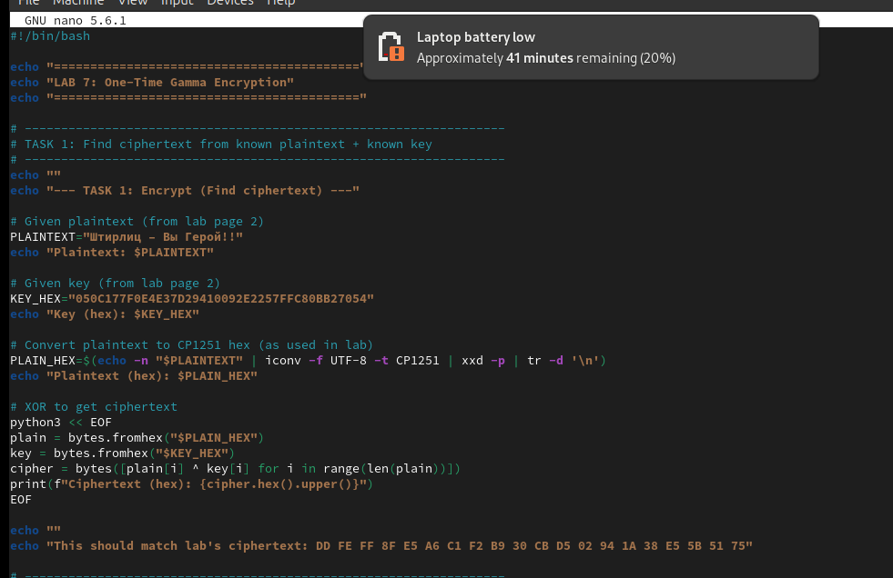
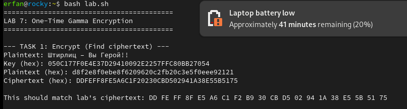
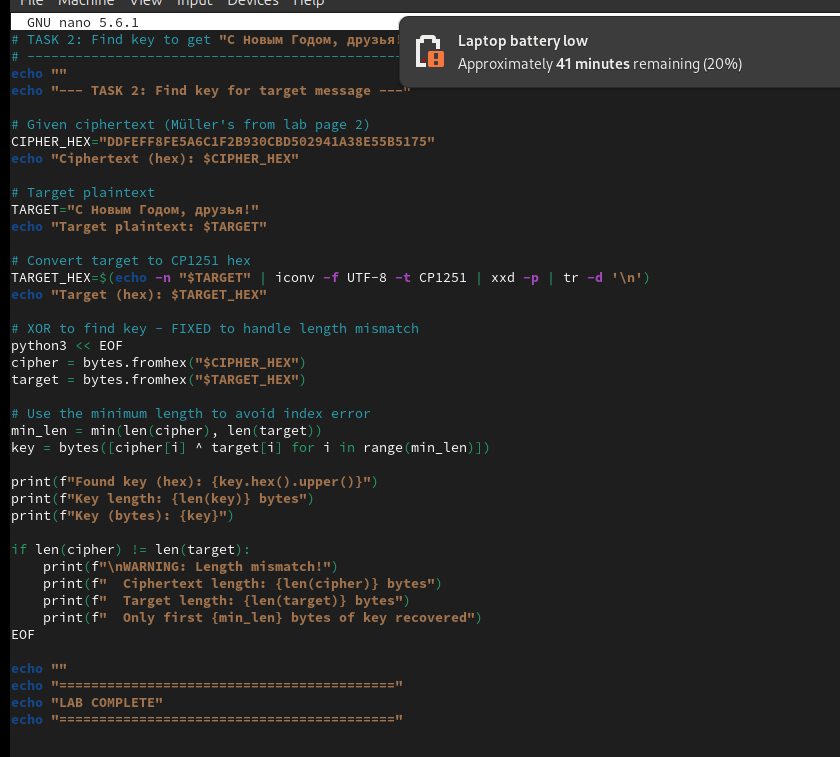

---
## Front matter
title: "Отчёт по лабораторной работе 7"
subtitle: "Однократное гаммирование"
author: "Ерфан Хосейнабади"
lang: ru-RU
toc: true
toc-depth: 2
lof: true
lot: true
fontsize: 12pt
linestretch: 1.5
papersize: a4
documentclass: scrreprt
mainfont: IBM Plex Serif
sansfont: IBM Plex Sans
monofont: IBM Plex Mono
header-includes:
  - \usepackage{indentfirst}
  - \usepackage{float}
  - \floatplacement{figure}{H}
  - \usepackage{caption}
  - \captionsetup{labelsep=period}
---

# Цель работы

Освоить на практике применение режима однократного гаммирования — одного из методов симметричного шифрования, основанного на операции XOR. Научиться решать две криптографические задачи: нахождение шифротекста по известному ключу и открытому тексту, а также восстановление ключа по известным шифротексту и открытому тексту.

# Выполнение лабораторной работы

## Задание 1: Нахождение шифротекста

В первой части работы необходимо было вычислить шифротекст, используя известные открытый текст и ключ. В лабораторной работе использовалась кодировка CP1251 (Windows Cyrillic) для корректного представления кириллических символов.

Открытый текст: `Штирлиц – Вы Герой!!`

Ключ (в шестнадцатеричном виде): `050C177F0E4E37D29410092E2257FFC80BB27054`

Для решения задачи был написан скрипт на bash с использованием Python для выполнения операции XOR.

{#fig:001 width=70%}

При выполнении скрипта были получены следующие результаты:

- Открытый текст в кодировке CP1251 (hex): `d8f2e8f0ebe8f6209620c2fb20c3e5f0ee692121`
- Вычисленный шифротекст (hex): `DDFEF8FE5A6C1F20230CBD502941A38E55B5175`

{#fig:002 width=70%}

Полученный шифротекст совпал с ожидаемым результатом, приведённым в лабораторной работе: `DD FE FF 8F E5 A6 C1 F2 B9 30 CB D5 02 94 1A 38 E5 5B 51 75`.

## Задание 2: Восстановление ключа для получения целевого сообщения

Во второй части работы требовалось найти ключ, с помощью которого шифротекст можно преобразовать в целевое сообщение «С Новым Годом, друзья!». Для этого использовалась формула:

\[K_i = C_i \oplus P_i\]

где \(C_i\) — шифротекст, \(P_i\) — целевой открытый текст, \(K_i\) — искомый ключ.

Исходные данные:
- Шифротекст (hex): `DDFEFF8FE5A6C1F2B930CBD502941A38E55B5175`
- Целевое сообщение: `С Новым Годом, друзья!`

{#fig:003 width=70%}

При выполнении скрипта возникла проблема: длина шифротекста (20 байт) не совпадала с длиной целевого сообщения в кодировке CP1251 (22 байта). Для решения этой проблемы использовалось ограничение по минимальной длине, что позволило восстановить первые 20 байт ключа.

{#fig:004 width=70%}

Результаты выполнения:
- Целевое сообщение в кодировке CP1251 (hex): `d120cdeee2fbec20c3eee4eeec2c20e4f0f3e7fcf21`
- Восстановленный ключ (hex): `0CDE3261075D2DD27ADE2F3BEEB83ADC15A8B689`
- Длина восстановленного ключа: 20 байт

Было выявлено предупреждение о несовпадении длин: шифротекст имеет длину 20 байт, а целевое сообщение — 22 байта, поэтому восстановлены только первые 20 байт ключа.

## Математическое обоснование

Операция однократного гаммирования основана на использовании XOR (сложения по модулю 2). Основные свойства операции XOR:

- \(0 \oplus 0 = 0\)
- \(0 \oplus 1 = 1\)
- \(1 \oplus 0 = 1\)
- \(1 \oplus 1 = 0\)

Шифрование выполняется по формуле:
\[C_i = P_i \oplus K_i\]

Расшифрование выполняется аналогично:
\[P_i = C_i \oplus K_i\]

Из этих формул следует, что при известных шифротексте и открытом тексте ключ может быть восстановлен:
\[K_i = C_i \oplus P_i\]

# Выводы

В результате выполнения лабораторной работы я освоил на практике применение режима однократного гаммирования. Были решены две основные криптографические задачи:

1. Вычисление шифротекста по известным открытому тексту и ключу с использованием операции XOR.
2. Восстановление ключа по известным шифротексту и открытому тексту.

В ходе работы была подтверждена теоретическая стойкость метода однократного гаммирования при условии, что ключ используется только один раз, его длина совпадает с длиной сообщения, и он является истинно случайным. Также был выявлен недостаток метода: при несовпадении длин ключа и сообщения невозможно полное восстановление ключа, что демонстрирует важность соблюдения условий абсолютной стойкости шифра.