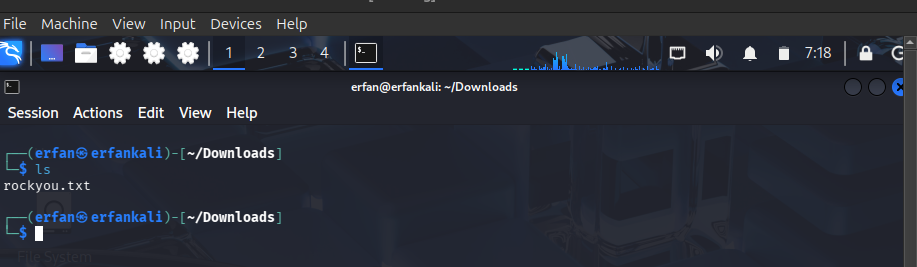
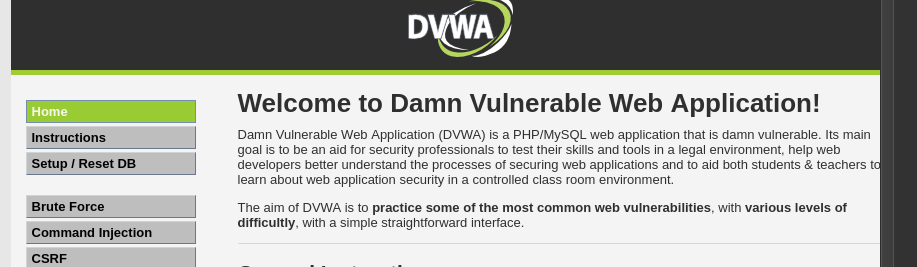
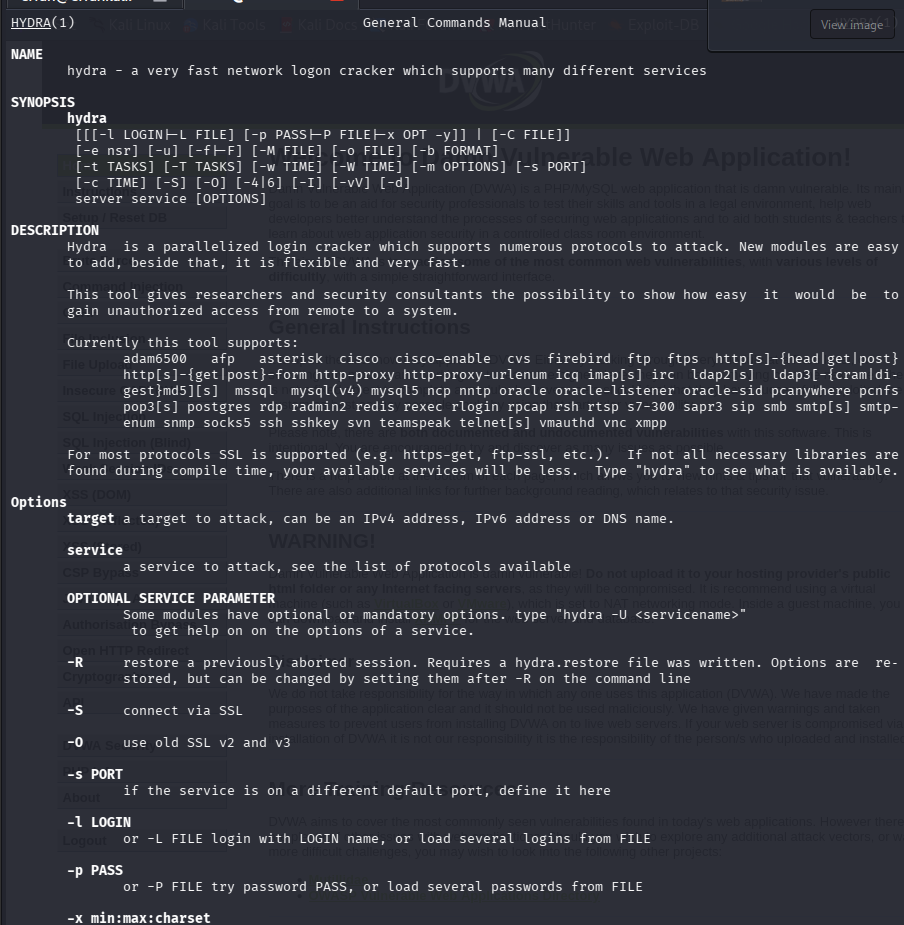
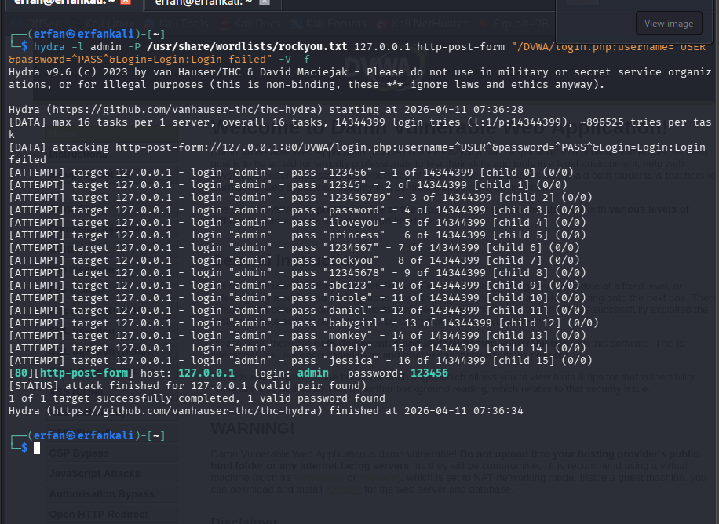
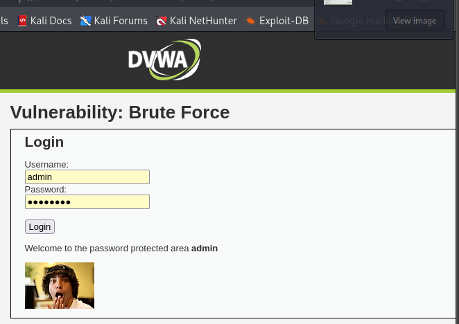

---
## Front matter
title: "Отчёт по индивидуальному проекту этап 3"
subtitile: "hydra"
author: "Ерфан Хосейнабади"
lang: ru-RU
toc: true
toc-depth: 2
lof: true
lot: true
fontsize: 12pt
linestretch: 1.5
papersize: a4
documentclass: scrreprt
mainfont: IBM Plex Serif
sansfont: IBM Plex Sans
monofont: IBM Plex Mono
header-includes:
  - \usepackage{indentfirst}
  - \usepackage{float}
  - \floatplacement{figure}{H}
  - \usepackage{caption}
  - \captionsetup{labelsep=period}
---

# Цель работы

Цель работы — получить практические навыки использования Hydra для подбора паролей (брутфорса).

# Задание

Реализовать атаку на уязвимость, используя брутфорс (подбор паролей).

# Выполнение лабораторной работы

Перед началом работы я подготовила список часто встречающихся паролей. Проверяю, что список на месте, и продолжаю работу.

{#fig:001 width=70%}

Затем вхожу в аккаунт DVWA, который создала в предыдущей работе, и перехожу в раздел Brute Force.

{#fig:002 width=70%}

Использую команду man, чтобы изучить справку Hydra и разобраться в её работе. Для выполнения задачи мне нужны опции -l (указывает логин) и -p (указывает пароль).

{#fig:003 width=70%}

Выполняю подбор пароля для пользователя admin с помощью файла rockyou.txt. Использую GET-запрос, передавая параметры cookie и PHPSESSID. При указании опции -P программа показывает подобранный пароль и путь к файлу со списком паролей (home/mwakutaipa/rockyou.txt)

{#fig:004 width=70%}

Использую найденный пароль для входа в систему, чтобы убедиться, что пароль верный.

{#fig:005 width=70%}

# Выводы

В результате выполнения работы я получила практические навыки использования Hydra для подбора паролей (брутфорса).

