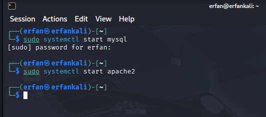
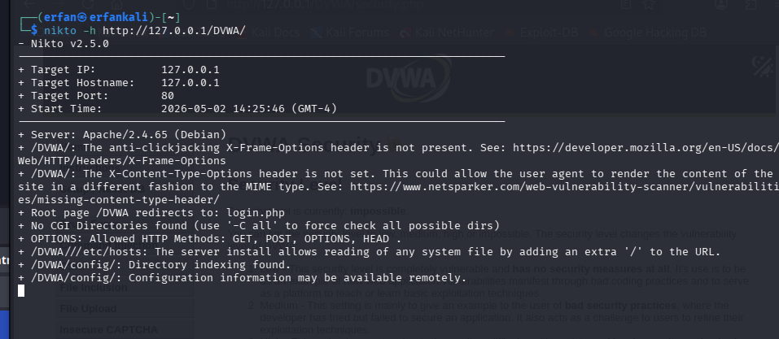

---
## Front matter
lang: ru-RU
title: Структура по индивидуальному проекту этап 4
subtitle: Nikto
author:
  - Ерфан Хосейнабади
institute:
  - Российский университет дружбы народов, Москва, Россия

## i18n babel
babel-lang: russian
babel-otherlangs: english

## Formatting pdf
toc: false
toc-title: Содержание
slide_level: 2
aspectratio: 169
section-titles: true
---

# Цель работы

Научиться тестировать веб-приложений со сканером nikto.

# Выполнение лабораторной работы

## запуск сервера

Я буду сканировать веб-приложение DVWA. Поэтому я запускаю его.

{#fig:001 width=70%}

## Изменение уровня безопасности

Далее изменяю уровня безопасности на среднее.

{#fig:002 width=70%}

## Сканирование 1 с nikto

Запускаю Nikto командой nikto, сканирую DVWA по полному URL (без порта).

{#fig:003 width=70%}

## Сканирование 2 с nikto

Сканирую второй раз — ввожу полный URL DVWA с портом. Результаты не сильно отличаются

{#fig:004 width=70%}

## Nikto

Nikto выводит не только адрес и порт, но и информацию об уязвимостях:

    Сервер: Apache/2.4.65 (Debian)

    В /DVWA/ нет заголовка X-Frame-Options (защита от clickjacking)...
    
    
# Выводы

Научилась тестировать веб-приложений со сканером nikto.