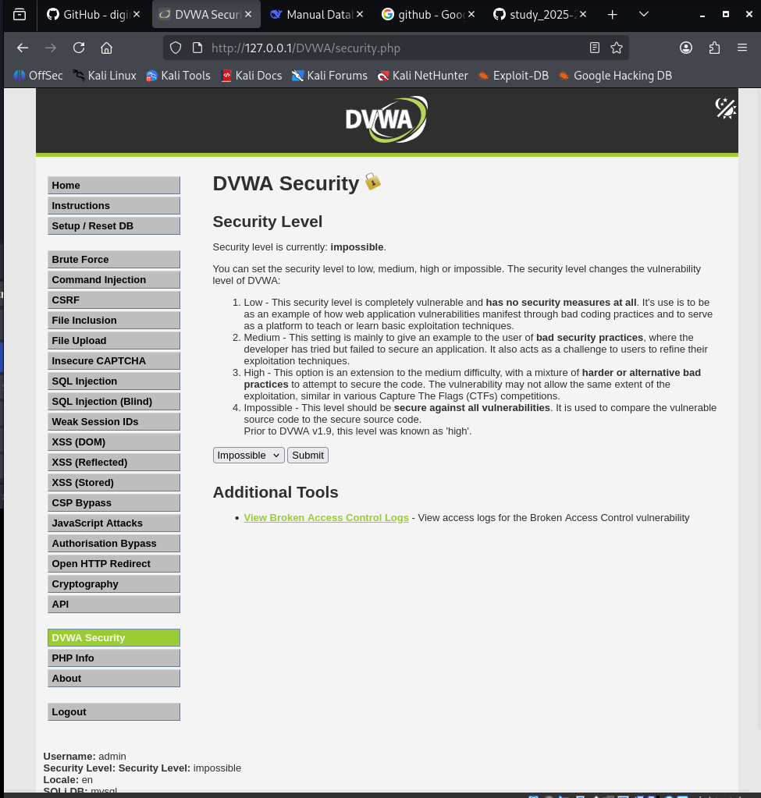
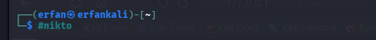

---
## Front matter
title: "Отчёт по индивидуальному проекту этап 4"
subtitle: "Nikto"
author: "Ерфан Хосейнабади"
lang: ru-RU
toc: true
toc-depth: 2
lof: true
lot: true
fontsize: 12pt
linestretch: 1.5
papersize: a4
documentclass: scrreprt
mainfont: IBM Plex Serif
sansfont: IBM Plex Sans
monofont: IBM Plex Mono
header-includes:
  - \usepackage{indentfirst}
  - \usepackage{float}
  - \floatplacement{figure}{H}
  - \usepackage{caption}
  - \captionsetup{labelsep=period}
---

# Цель работы

Научиться тестировать веб-приложений со сканером nikto.

# Выполнение лабораторной работы

Я буду сканировать веб-приложение DVWA. Поэтому я запускаю его.

{#fig:001 width=70%}

Далее изменяю уровня безопасности на среднее.

{#fig:002 width=70%}

Запускаю Nikto командой nikto, сканирую DVWA по полному URL (без порта).

{#fig:003 width=70%}

Сканирую второй раз — ввожу полный URL DVWA с портом. Результаты не сильно отличаются

{#fig:004 width=70%}

Nikto выводит не только адрес и порт, но и информацию об уязвимостях:

    Сервер: Apache/2.4.65 (Debian)

    В /DVWA/ нет заголовка X-Frame-Options (защита от clickjacking)...
    
    
# Выводы

Научилась тестировать веб-приложений со сканером nikto.