# Отчёт - Раздел 1 (Введение)

## Вопрос 1

**Ответ:** HTTPS  
**Пояснение:** Протокол HTTPS работает на прикладном уровне.

## Вопрос 2

**Ответ:** Транспортном  
**Пояснение:** TCP работает на транспортном уровне.

## Вопрос 3

**Ответ:** 90.11.90.22, 25.198.0.15  
**Пояснение:** IPv4 адрес = 4 числа от 0 до 255.

## Вопрос 4

**Ответ:** сопоставляет IP адреса доменным именам  
**Пояснение:** DNS превращает домены в IP.

## Вопрос 5

**Ответ:** прикладной -- транспортный -- сетевой -- канальный  
**Пояснение:** Порядок уровней TCP/IP сверху вниз.

## Вопрос 6

**Ответ:** передачу данных в открытом виде  
**Пояснение:** HTTP без шифрования.

## Вопрос 7

**Ответ:** двух фаз: рукопожатия и передачи данных  
**Пояснение:** Сначала рукопожатие, потом данные.

## Вопрос 8

**Ответ:** и клиентом, и сервером в процессе "переговоров"  
**Пояснение:** Они договариваются о версии.

## Вопрос 9

**Ответ:** шифрование данных  
**Пояснение:** Шифрование ПОСЛЕ рукопожатия.

## Вопрос 10

**Ответ:** идентификатор пользователя, id сессии  
**Пояснение:** Куки хранят ID, не пароли.

## Вопрос 11

**Ответ:** улучшения надежности соединения  
**Пояснение:** Это задача TCP, не куки.

## Вопрос 12

**Ответ:** сервером  
**Пояснение:** Сервер создает куки.

## Вопрос 13

**Ответ:** Да, на время пользования веб-сайтом  
**Пояснение:** Сессионные куки живут пока браузер открыт.

## Вопрос 14

**Ответ:** 3  
**Пояснение:** TOR: entry → middle → exit.

## Вопрос 15

**Ответ:** отправителю, выходному узлу  
**Пояснение:** Только они знают IP получателя.

## Вопрос 16

**Ответ:** с охранным, промежуточным и выходном узлом  
**Пояснение:** Ключи со всеми 3 узлами.

## Вопрос 17

**Ответ:** Нет  
**Пояснение:** Получатель может использовать любой браузер.

## Вопрос 18

**Ответ:** технология IEEE 802.11  
**Пояснение:** Wi-Fi = стандарт 802.11.

## Вопрос 19

**Ответ:** Канальном  
**Пояснение:** Wi-Fi работает на L2 (канальный уровень).

## Вопрос 20

**Ответ:** WEP  
**Пояснение:** WEP = старый и небезопасный.

## Вопрос 21

**Ответ:** передаются в зашифрованном виде после аутентификации  
**Пояснение:** После входа пароля - шифрование.

## Вопрос 22

**Ответ:** WPA2 Personal  
**Пояснение:** Для дома - WPA2 Personal с паролем.

# Отчёт - Раздел 2

## Вопрос 23
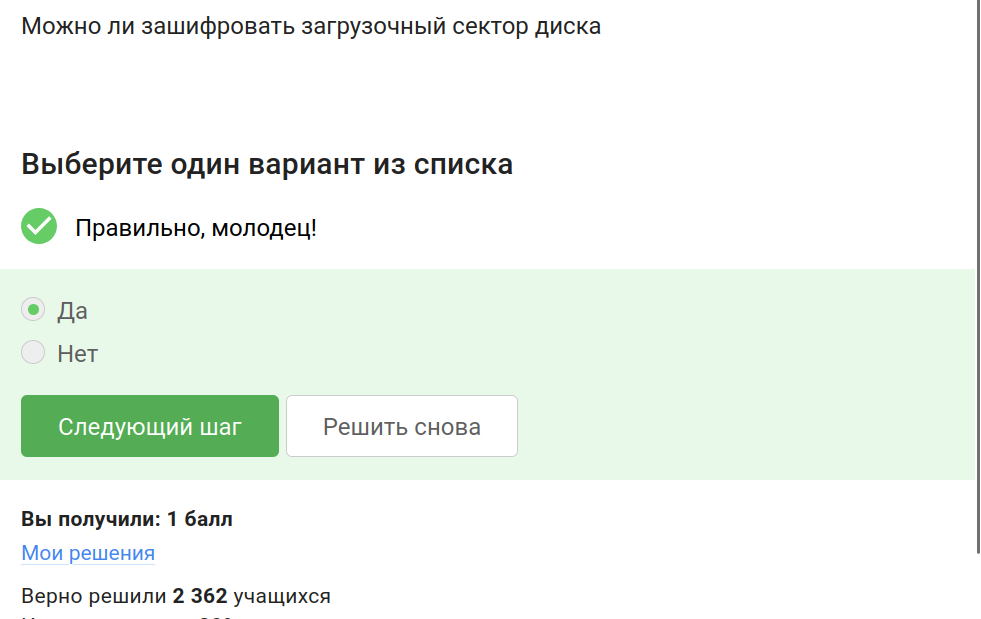
**Ответ:** Да  
**Пояснение:** Загрузочный сектор диска можно зашифровать с помощью BitLocker или VeraCrypt.

## Вопрос 24
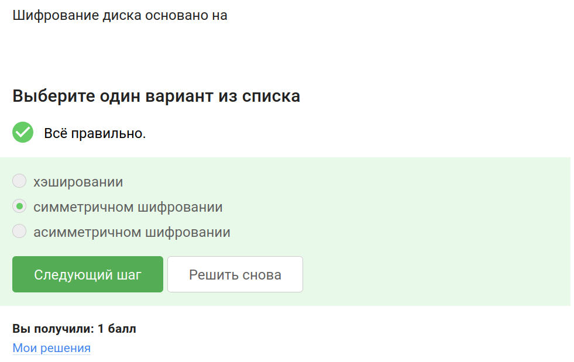
**Ответ:** симметричном шифровании  
**Пояснение:** Дисковое шифрование использует один ключ для шифрования и расшифровки.

## Вопрос 25
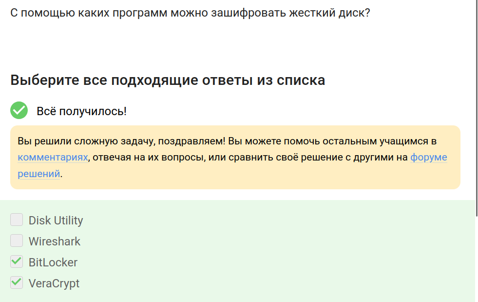
**Ответ:** VeraCrypt, BitLocker  
**Пояснение:** VeraCrypt и BitLocker шифруют диски.

## Вопрос 26
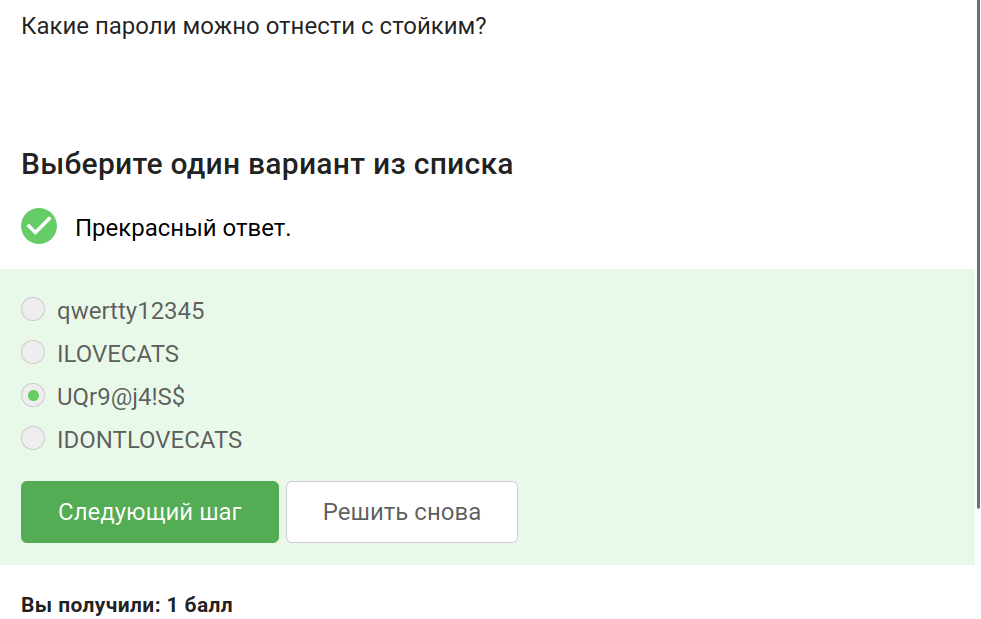
**Ответ:** UQr9@j4!S$  
**Пояснение:** Стойкий пароль содержит буквы в разных регистрах, цифры и спецсимволы.

## Вопрос 27
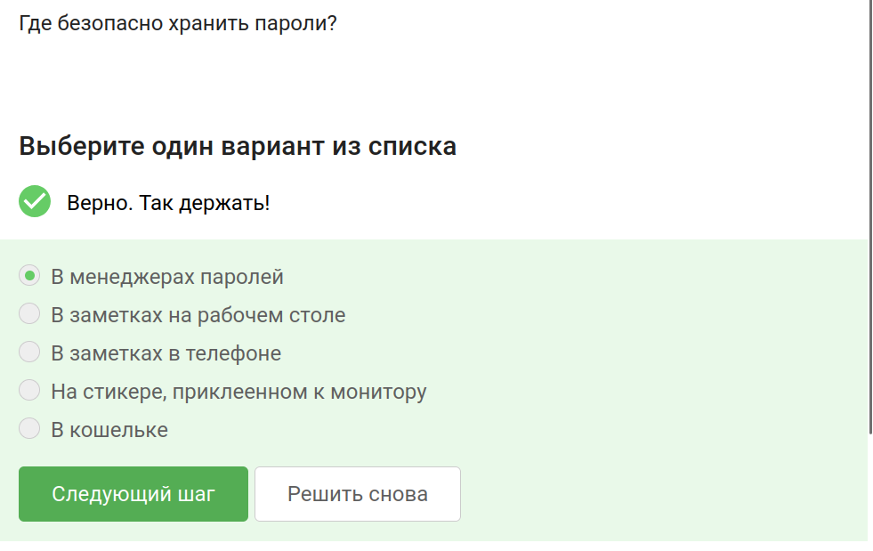
**Ответ:** В менеджерах паролей  
**Пояснение:** Менеджеры паролей хранят пароли безопасно в зашифрованном виде.

## Вопрос 28
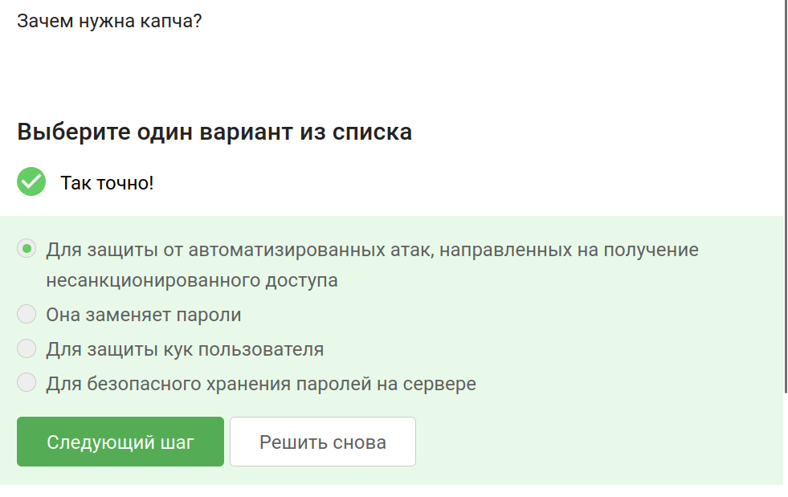
**Ответ:** Для защиты от автоматизированных атак  
**Пояснение:** Капча отличает человека от бота, предотвращая автоматический перебор.

## Вопрос 29
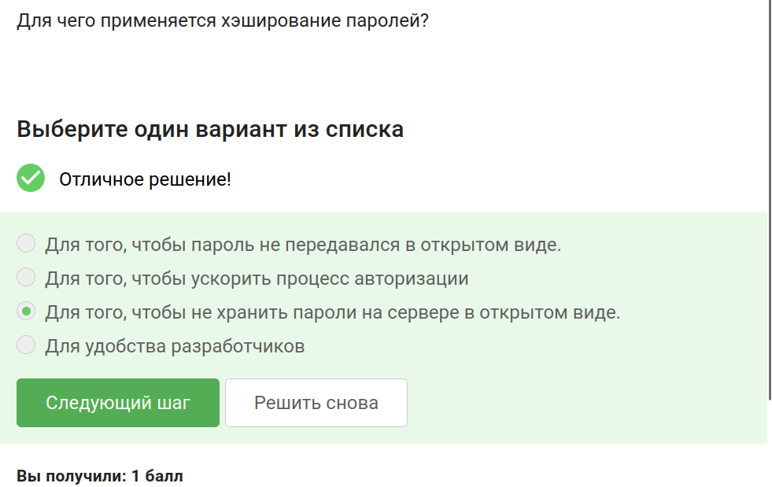
**Ответ:** Для того, чтобы не хранить пароли на сервере в открытом виде  
**Пояснение:** Хэширование хранит только хэш пароля, а не сам пароль.

## Вопрос 30
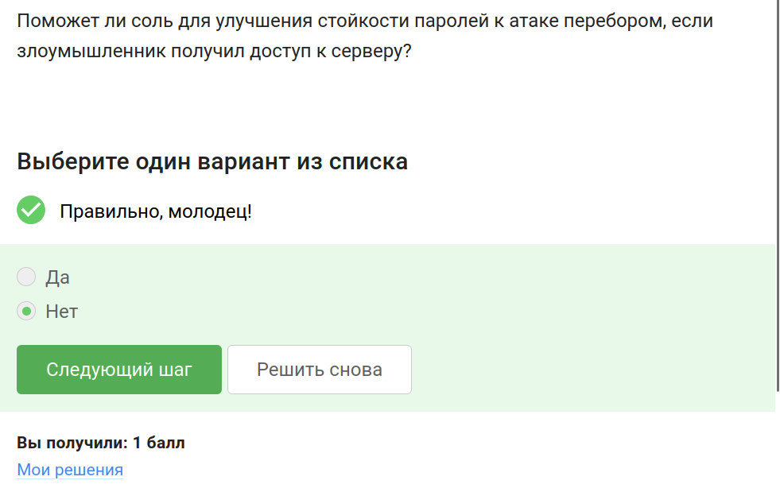
**Ответ:** Нет  
**Пояснение:** Соль не спасает, если злоумышленник уже получил доступ к серверу и хэшам.

## Вопрос 31
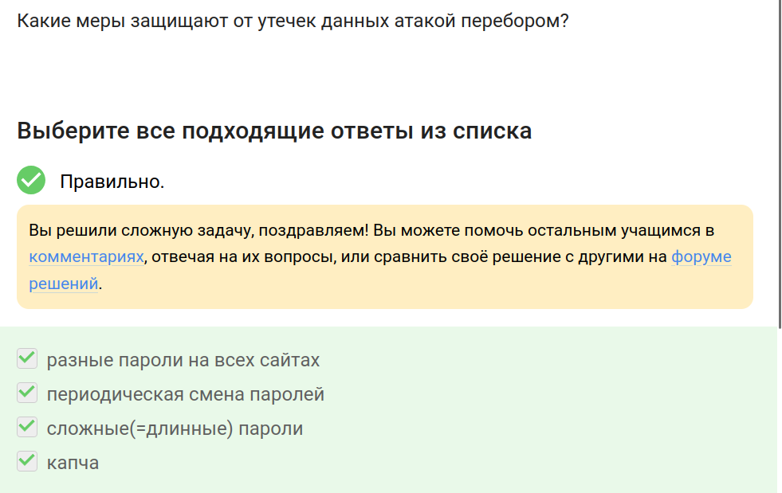
**Ответ:** разные пароли на всех сайтах, периодическая смена паролей, сложные пароли, капча  
**Пояснение:** Все эти меры защищают от атак перебором.

## Вопрос 32
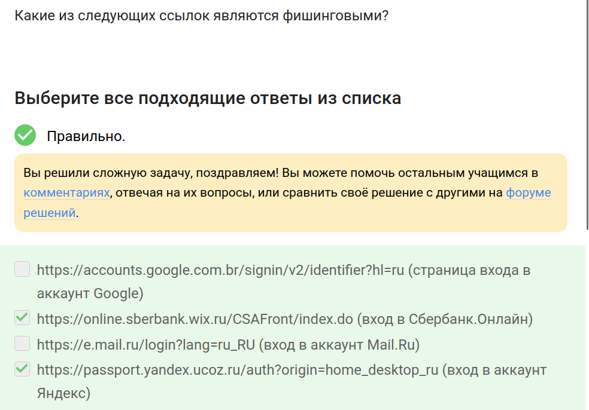
**Ответ:** https://online.sberbank.wix.ru/..., https://passport.yandex.ucoz.ru/...  
**Пояснение:** Фишинговые ссылки используют подозрительные домены (wix.ru, ucoz.ru).

## Вопрос 33
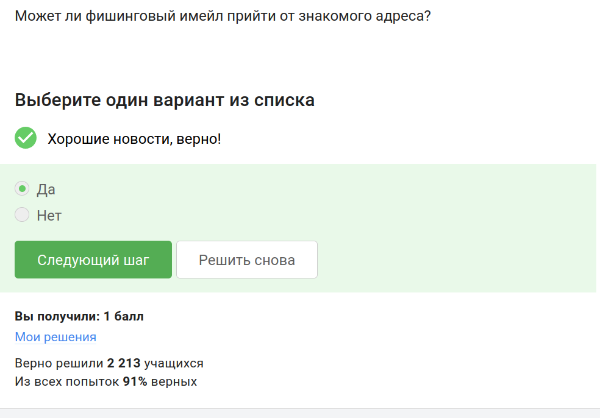
**Ответ:** Да  
**Пояснение:** Адрес отправителя можно подделать (спуфинг), поэтому письмо может прийти от знакомого адреса.

## Вопрос 34
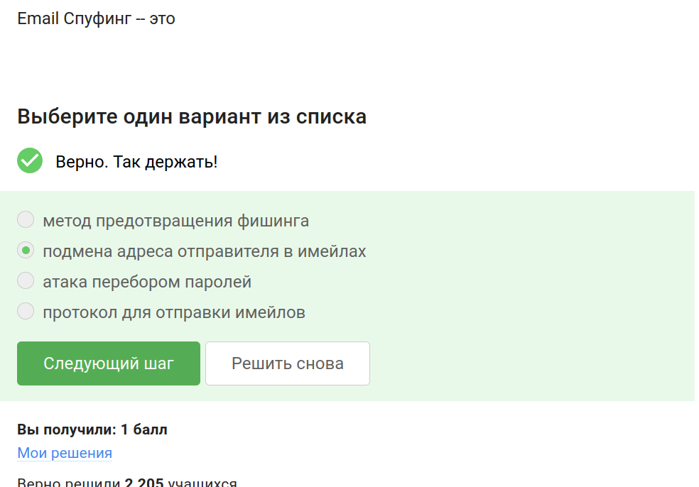
**Ответ:** подмена адреса отправителя в имейлах  
**Пояснение:** Email spoofing = подмена адреса отправителя для обмана жертвы.

## Вопрос 35
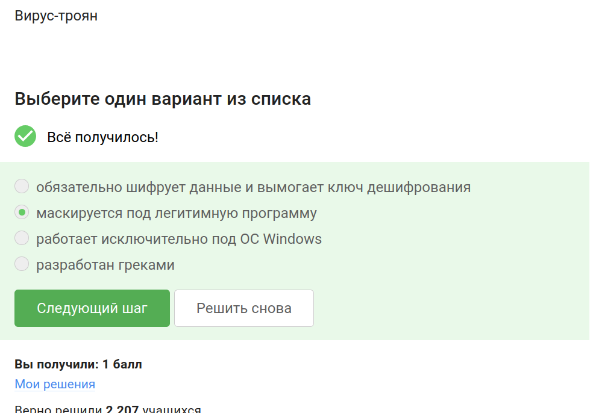
**Ответ:** маскируется под легитимную программу  
**Пояснение:** Троян маскируется под полезное ПО, но выполняет вредоносные действия.

## Вопрос 36
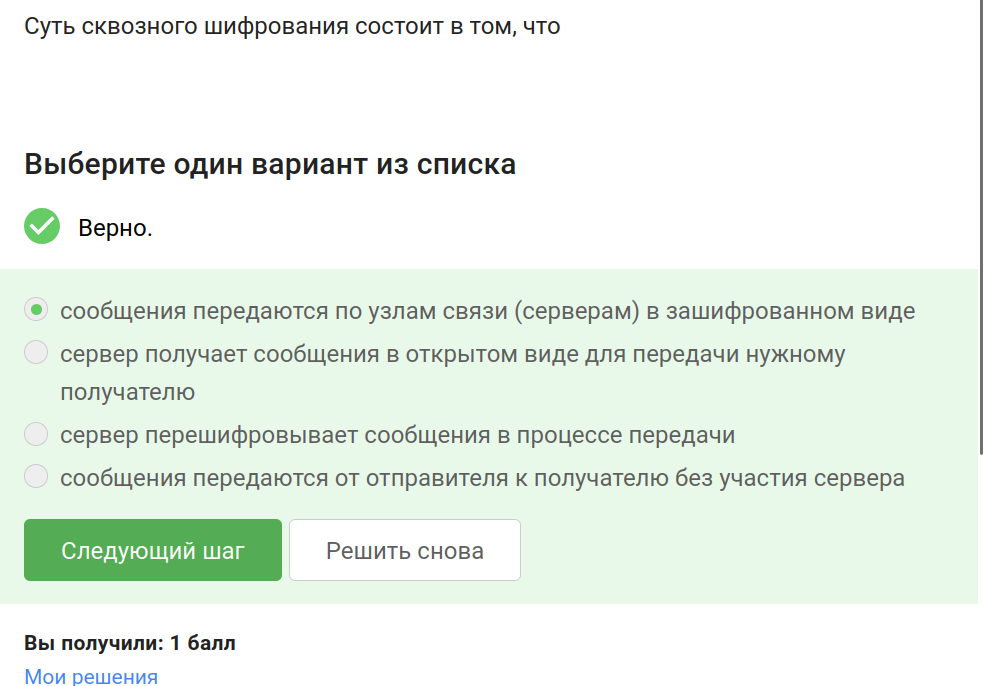
**Ответ:** сообщения передаются по узлам связи (серверам) в зашифрованном виде  
**Пояснение:** Сквозное шифрование = сервер не видит содержимое сообщений.